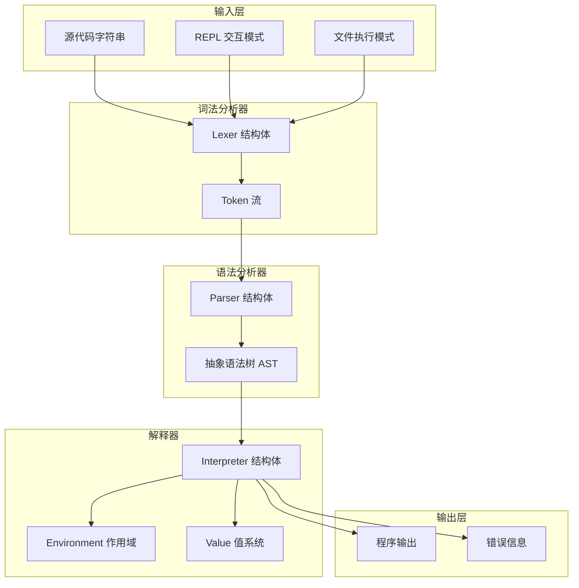
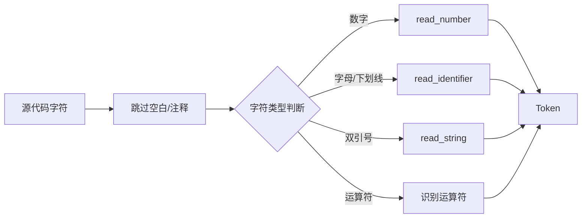
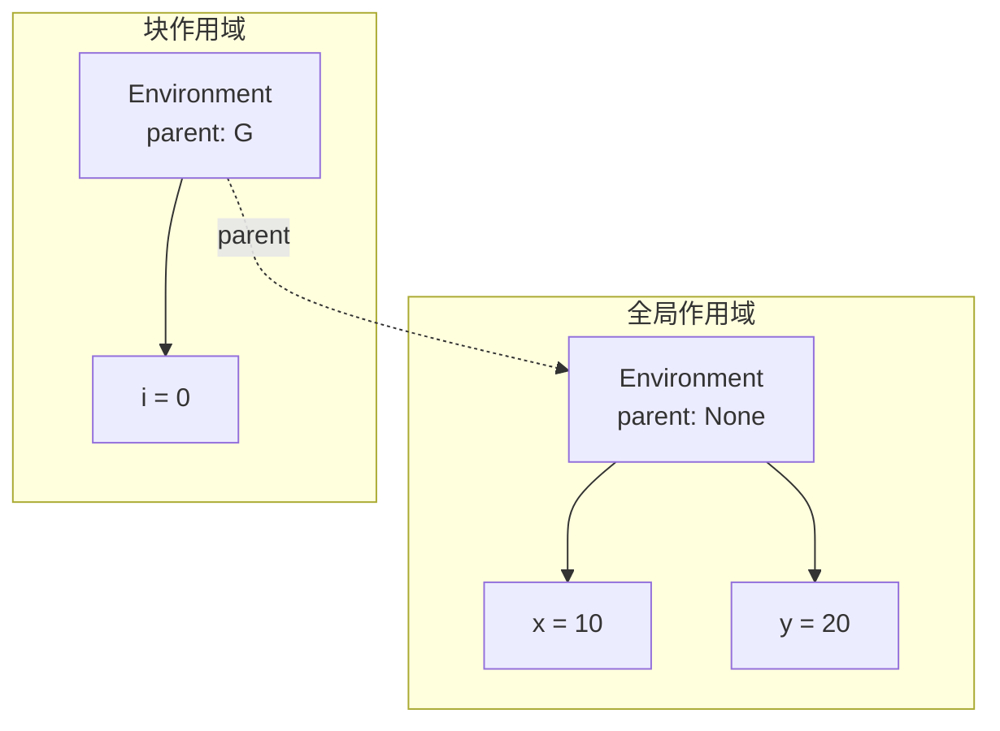
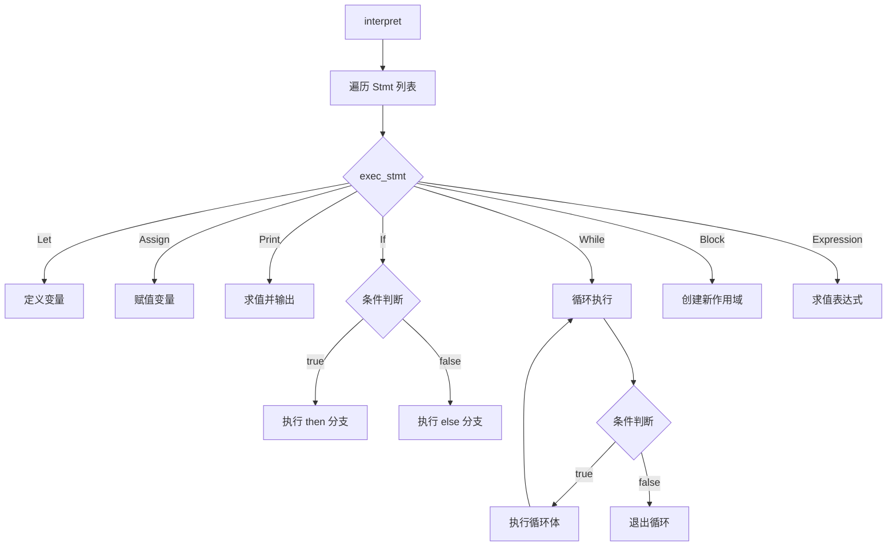
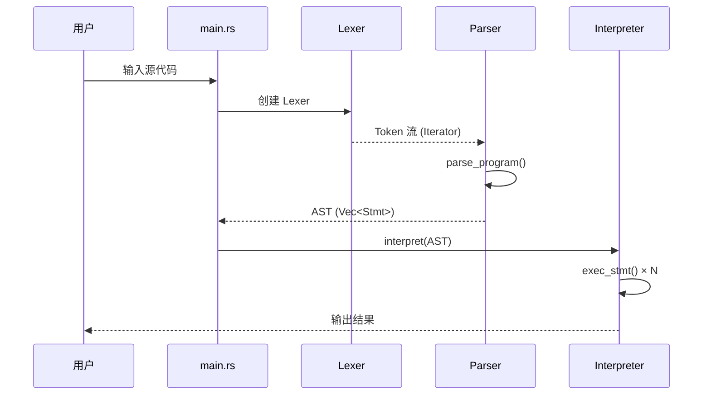

# Hul 语言解释器架构文档

## 项目概述

Hul 是一个使用 Rust 实现的解释型编程语言，采用经典的**三阶段架构**：词法分析 → 语法分析 → 解释执行。

## 架构图



## 模块结构

```
src/
├── main.rs         # 程序入口，文件执行/REPL 模式切换
├── lexer.rs        # 词法分析器，将源代码转换为 Token 流
├── parser.rs       # 语法分析器，将 Token 流转换为 AST
├── ast.rs          # 抽象语法树定义（Stmt、Expr）
├── interpreter.rs  # 解释器，遍历 AST 执行程序
└── value.rs        # 值系统与环境管理
```

## 核心模块详解

### 1. 词法分析器 (Lexer)

**文件**: [`src/lexer.rs`](src/lexer.rs)

**职责**: 将源代码字符串转换为 Token 流

**关键组件**:
- [`TokenType`](src/lexer.rs:10) - Token 类型枚举，包含所有支持的词法单元
- [`Token`](src/lexer.rs:88) - 带位置信息的 Token 结构体
- [`Lexer`](src/lexer.rs:108) - 词法分析器，实现 `Iterator` trait

**支持的 Token 类型**:
- 字面量：`Number(f64)`、`String(String)`、`True`、`False`、`Nil`
- 标识符：`Identifier(String)`
- 关键字：`let`、`if`、`else`、`while`、`print`、`and`、`or`、`not`
- 运算符：`+`、`-`、`*`、`/`、`%`、`==`、`!=`、`<`、`<=`、`>`、`>=`、`=`
- 分隔符：`(`、`)`、`{`、`}`、`;`
- 结束标记：`Eof`

**工作流程**:


### 2. 语法分析器 (Parser)

**文件**: [`src/parser.rs`](src/parser.rs)

**职责**: 将 Token 流转换为抽象语法树 (AST)

**关键组件**:
- [`Parser`](src/parser.rs:5) - 语法分析器结构体
- [`parse_program()`](src/parser.rs:41) - 程序入口解析方法

**解析策略**: 采用 **Pratt 解析器**（自顶向下运算符优先级解析）

**运算符优先级**（从低到高）:
```
assignment (=)
or (or)
and (and)
equality (==, !=)
comparison (<, <=, >, >=)
term (+, -)
factor (*, /, %)
unary (-, not)
primary (字面量、变量、分组)
```

**语句类型**:
- `let` 语句：变量声明
- `if` 语句：条件分支
- `while` 语句：循环
- `print` 语句：输出
- `block` 语句：代码块
- `expression` 语句：表达式语句

### 3. 抽象语法树 (AST)

**文件**: [`src/ast.rs`](src/ast.rs)

**语句节点** [`Stmt`](src/ast.rs:3):
```rust
enum Stmt {
    Let { name: String, initializer: Expr },
    Assign { name: String, value: Expr },
    Print(Expr),
    If { condition: Expr, then_branch: Vec<Stmt>, else_branch: Option<Vec<Stmt>> },
    While { condition: Expr, body: Vec<Stmt> },
    Block(Vec<Stmt>),
    Expression(Expr),
}
```

**表达式节点** [`Expr`](src/ast.rs:27):
```rust
enum Expr {
    Literal(Value),
    Variable(String),
    Binary { left: Box<Expr>, operator: BinaryOp, right: Box<Expr> },
    Unary { operator: UnaryOp, right: Box<Expr> },
    Logical { left: Box<Expr>, operator: LogicalOp, right: Box<Expr> },
    Grouping(Box<Expr>),
}
```

### 4. 值系统 (Value)

**文件**: [`src/value.rs`](src/value.rs)

**值类型** [`Value`](src/value.rs:17):
```rust
enum Value {
    Number(f64),
    String(String),
    Boolean(bool),
    Nil,
}
```

**可变值引用** [`ValueRef`](src/value.rs:49):
```rust
type ValueRef = Rc<RefCell<Value>>;
```
使用 `Rc<RefCell<>>` 实现共享所有权的内部可变性。

**真值判断** [`is_truthy()`](src/value.rs:79):
- `Nil` → false
- `Boolean(false)` → false
- 其他所有值（包括 `0` 和空字符串）→ true

### 5. 环境与作用域 (Environment)

**文件**: [`src/value.rs`](src/value.rs:90-199)

**结构设计**:


**关键方法**:
- [`define()`](src/value.rs:147) - 在当前作用域定义变量
- [`assign()`](src/value.rs:163) - 赋值（沿作用域链查找）
- [`get()`](src/value.rs:187) - 获取变量值（沿作用域链查找）

### 6. 解释器 (Interpreter)

**文件**: [`src/interpreter.rs`](src/interpreter.rs)

**职责**: 遍历 AST 执行程序

**核心流程**:


**作用域管理**:
```rust
// 进入块作用域
let old_env = self.env.clone();
self.env = Rc::new(RefCell::new(Environment::new_with_parent(old_env.clone())));

// 执行块内语句
let result = self.exec_block(stmts);

// 恢复外层作用域
self.env = old_env;
```

## 执行流程



## 错误处理

采用 `Result<T, String>` 进行错误传播：

- **词法错误**: panic（未知字符）
- **语法错误**: `Err(String)`（期望 token 不匹配）
- **运行时错误**: `Err(String)`（未定义变量、类型错误等）

## 已修复的问题

### Bug 1: Lexer 无限循环

**问题**: EOF 时返回 `Some(Eof)` 而非 `None`，导致 `collect()` 无限迭代

**修复**: 添加 `eof_returned: bool` 字段，确保 EOF 只返回一次 `Some(Eof)`，之后返回 `None`

### Bug 2: Parser 赋值表达式变量名丢失

**问题**: 赋值表达式解析时，`left` 被错误设置为 `Literal(Nil)` 而非 `Variable(name)`

**修复**: 正确保留变量名 `Expr::Variable(name)`

## 技术选型

| 方面 | 选择 | 原因 |
|------|------|------|
| 语言 | Rust | 内存安全、零成本抽象 |
| 值共享 | `Rc<RefCell<Value>>` | 共享所有权 + 内部可变性 |
| 作用域实现 | 链式 Environment | 支持词法作用域嵌套 |
| 表达式解析 | Pratt 解析器 | 简洁处理运算符优先级 |
| 错误处理 | `Result<T, String>` | 简单直观的错误传播 |

## 未来扩展方向

1. **函数支持**: 添加函数声明、调用、闭包
2. **垃圾回收**: 替换 `Rc` 为更高效的内存管理
3. **类型系统**: 静态类型检查
4. **编译目标**: 编译为字节码或原生代码
5. **标准库**: 内置函数和数据结构